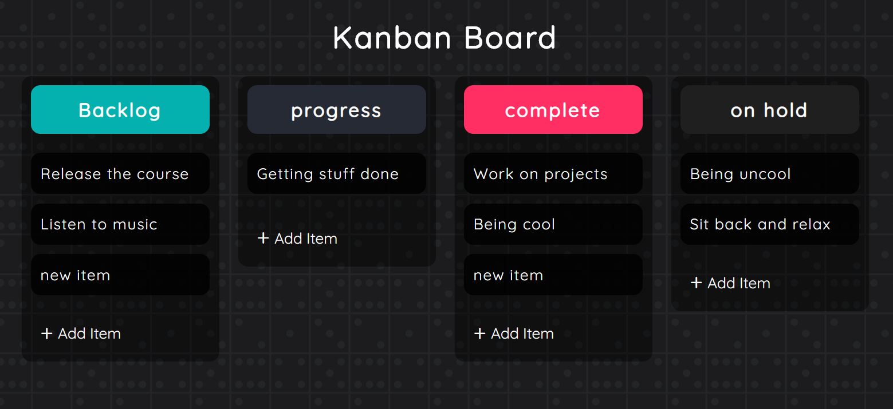

# Kanban board

Organize your task with Kanban board logic to keep track of your progress visually. You can add, modify, move and delete task dynamically.

Kanban board is:

> A **Kanban board** is one of the tools that can be used to implement [Kanban](https://en.wikipedia.org/wiki/Kanban_(development)) to manage work at a personal or organizational level.
>
> Kanban boards visually depict work at various stages of a process using cards to represent work items and columns to represent each stage of the process. Cards are moved from left to right to show progress and to help coordinate teams performing the work. A Kanban board may be divided into horizontal "swimlanes" representing different kinds of work or different teams performing the work.
>
> ([wikipedia](https://en.wikipedia.org/wiki/Kanban_board#:~:text=A%20Kanban%20board%20is%20one,each%20stage%20of%20the%20process.))